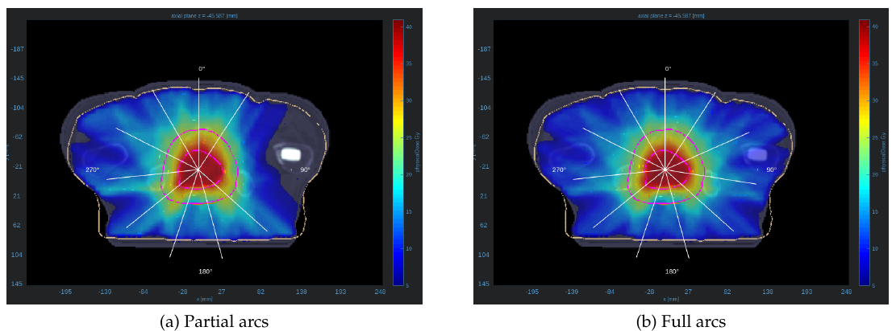
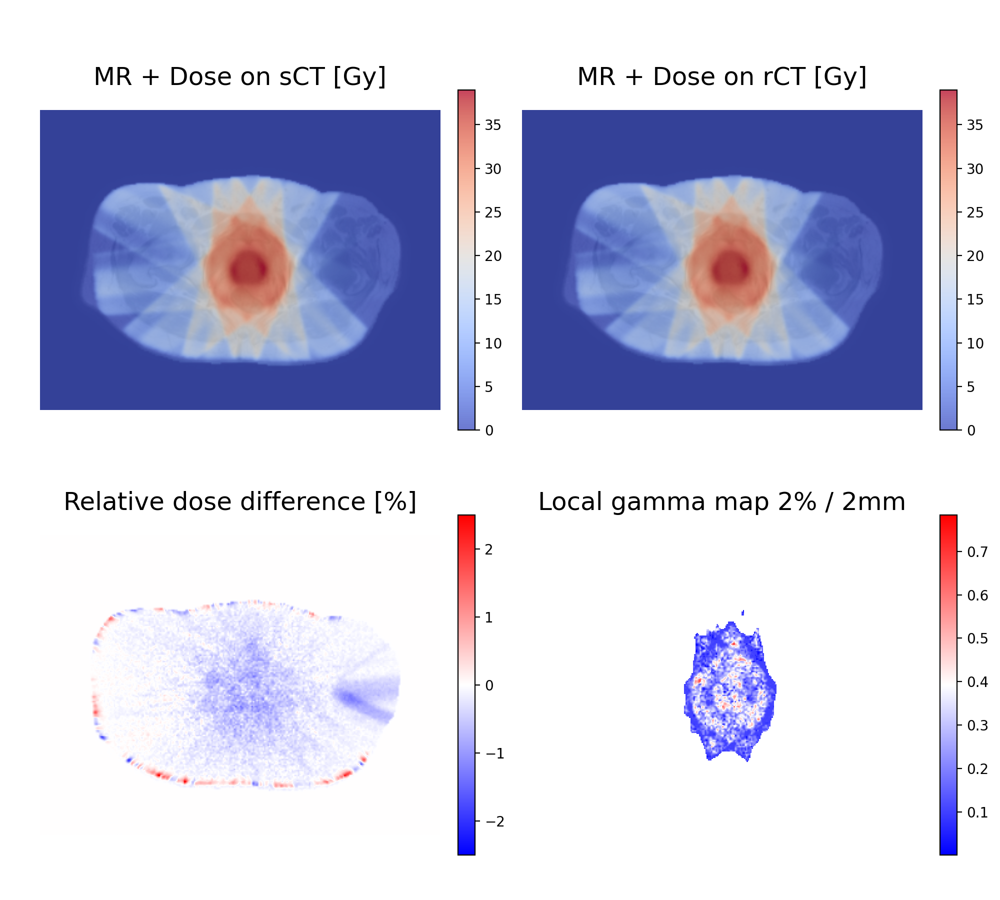
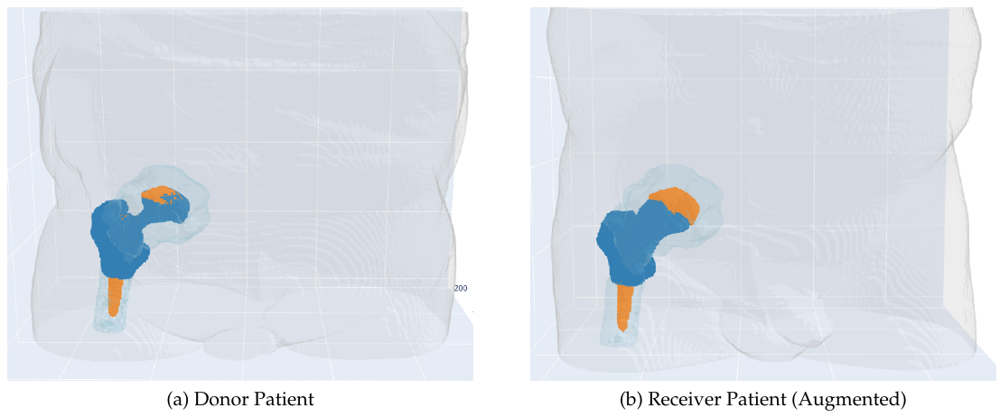
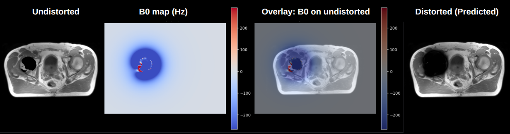
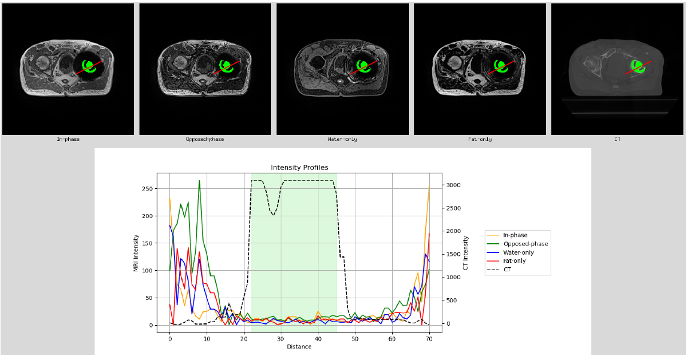

# Robust MR-Based Synthetic CT Generation for Patients with Implants

Source code of the experiments performed in the MICCAI paper submission **Attention is Matter for Inclusiveness: Generating Synthetic CT for Patients with Hip Implants**. The work investigates the use of GAN-based deep learning methods for generating synthetic CTs from MR images in patients with hip implants, addressing the challenges of metal-induced artifacts. The goal is to enable more robust and inclusive MR-only radiotherapy workflows.

---
## Setup Instructions

### Installation

Clone the github repository:  
```
git clone https://github.com/nczala/sct-metal-implants-paper.git  
cd sct-metal-implants-paper
```

### Create the environment
This project uses [Conda](https://docs.conda.io/en/latest/) for dependency management.
```
conda env create -f environment.yml
```

---
## Run environment
The performance requiring calculations were run on a HPC environment with the open-source job-scheduler SLURM. All scripts in this thesis have been designed accordingly, please see https://slurm.schedmd.com for details. 

---
## Data

This project was performed using two datasets:

- **Internal University Hospital Zurich (USZ) dataset**, which cannot be shared publicly due to data protection and privacy restrictions.
- **SynthRAD2023 dataset**, available in the [data/synthRAD2023](/data/synthRAD2023) folder.

### Expected structure

Patients are organized into two groups:
- **With hip implant** → patient IDs start with `Pat0XX`
- **Without implant** → patient IDs start with `Pat2XX`

For each patient, the following data are required:
- **CT** scans (co-registered to MR in-phase)
- **Dixon MR reconstruction**: in-phase 
- **RTst** folder containing the structure file (contours)

The raw data should be arranged as follows:

```text
raw_data/
    patients_with_hip_implant/
        Pat001/
            CT/        # Coregistered CT images
            MR_in/     # MR in-phase
            RTst/      # Structure file (contours)
        Pat002/
            ...
    patients_without_implant/
        Pat201/
            CT/
            MR_in/
            RTst/
        Pat202/
            ...
```

---
## Data Preprocessing

#### Prerequisites:
- Set up directory where preprocessed data should be saved
- Define **patient_info.xlsx** according to the example in [/configs](/configs/preprocessing) containing information
about data set split and slice information per patient. Place it in ```/Excel``` folder of preprocessing directory.

### Running the pipeline
#### Running from single script
The entire pipeline can be run with a single bash script (in [/scripts](/scripts) directory):

```sbatch preprocessing_pipeline.sh```

**Note:** Adjust dataset paths and parameters directly in the bash script.
Job logs will be saved to the path defined in the --output argument of the script.

#### Running step by step
Each preprocessing stage can also be executed individually via command line in the following order:

```python 01_preprocessing.py --help```  → Converts DICOM to NIfTI, extracts body/metal masks, and saves metadata  
```python 02_resampling_and_resizing.py --help```  → Resamples to fixed voxel spacing and resizes to desired image size.  
```python 03_normalization.py --help```   → Normalizes CT and MR intensity ranges.  
```python 04_dataset_creation.py  --help```   → Splits volumes into 2D slices for training/test datasets. 

For the available parameters, use the ```--help``` flag or check the python files. The files can be found in the [/sct_metal_implants/preprocessing](/sct_metal_implants/preprocessing) folder.

---
## Model Training, Inference and Evaluation

This project builds on the existing GAN framework **Pix2Pix** based on the official [repository](https://github.com/junyanz/pytorch-CycleGAN-and-pix2pix).  

The adapted framework is located in the [/external_models](/external_models) directory.  
Details on the modifications made for this project can be found in the [README](/external_models/README.md) of the `/external_models` folder.  

#### Prerequisites:
- Preprocessed data from the **Data Preprocessing** step is required as input.  
- Make sure to have defined cross-validation splits in **patient_info.xlsx** according to the example in [/configs](/configs/preprocessing).

#### Run Pix2Pix model from single script (training, testing, evaluation)

For convenience, the model has a wrapper script that executes training, testing, and evaluation in sequence.
The scripts can be found in the folder [/scripts](/scripts).

```sbatch train_test_eval_pix2pix.sh```

#### Procedure (running step by step)

1. **Training**  
   Calls the corresponding `train.py` inside the model framework.  

2. **Inference**  
   Calls the corresponding `test.py` to generate synthetic CTs from MR.  

3. **Evaluation**  
   Runs `evaluation.py` to compute image similarity metrics between synthetic and ground-truth CT. 

#### Notes:
- Paths, hyper-parameters, and dataset splits are configured inside `train_test_eval_pix2pix.sh` script.  
- For available options in the original frameworks, check:
  ```
  python train.py --help
  python test.py --help
  python evaluation.py --help
  ```

---
## Model Evaluation

### Image Similarity Evaluation

The files can be found in the [/sct_metal_implants/evaluation/image_similarity_evaluation](/sct_metal_implants/evaluation/image_similarity_evaluation) folder.  
The image similarity evaluation can be run with the following script. 
For the available parameters, use the ```--help``` flag or check the python files.

```python evaluation.py --help```

The model evaluation is typically applied directly in the train-test-eval pipeline as described above.

### Dosimetric Evaluation

Clone the [MatRad](https://github.com/e0404/matRad) repository. 
Use the file ```dosimetric_evaluation_hip_implants.m``` to calculate DVH differences
in the partial arc scenario (avoiding irradiation through implant). And use the file ```dosimetric_evaluation_hip_implants_all_angles.m```
for the full arc scenario (irradiating through implant). The files can be found in the [/sct_metal_implants/evaluation/dosimetric_evaluation](/sct_metal_implants/evaluation/dosimetric_evaluation) folder.


Before running the dosimetric evaluation, the synthetic CT NFTI files have to be resized and resampled to
DICOM files with original voxel and image size. The following script can be used for this: ```sbatch postprocessing.sh```

The dosimetric evaluation can be run using the bash script: ```dosimetric_evaluation.sh```.
Adjust dataset paths and parameters directly in the bash script, which can be found in the [/scripts](/scripts) directory.


### Gamma analysis
<p align="center">
    
</p>

To further analyze the agreement between the dose distribution on the sCT and the dose distribution calculated by matRad,
run the gamma analysis using the bash script: ```run_gamma_analysis.sh```.
Adjust dataset paths and parameters directly in the bash script, which can be found in the [/scripts](/scripts) directory.

It can also be run from command line:  

```python gamma_analysis.py --help```

For the available parameters, use the ```--help``` flag or check the python files. The file can be found in [/sct_metal_implants/evaluation/gamma_analysis](/sct_metal_implants/evaluation/gamma_analysis) folder.

---
## Data Augmentation

### Donor-Receiver (DR) Augmentation


The DR augmentation pipeline extracts hip implants from a donor patient and inserts them into a receiver patient. 
It also supports inserting implants from two different donors into the same receiver.

#### Prerequisites:
- Define **data_augmentation_configurations.xlsx** according to [example](/configs/data_augmentation) in ```/configs```. 
This excel contains the information about donor and receiver patients.

#### Run DR Augmentation Pipeline

The DR augmentation pipeline can be run via bash script directly (in [/scripts](/scripts) directory):  

```sbatch donor_receiver_augmentation.sh```  

**Note:** Adjust dataset paths and parameters directly in the bash script.

It can also be run from command line:  

```python run_data_augmentation.py --help```

For the available parameters, use the ```--help``` flag or check the python files. The file can be found in [/sct_metal_implants/data_augmentation/donor_receiver](/sct_metal_implants/data_augmentation/donor_receiver) folder.

### Physics-Guided (Ph) Augmentation


The Ph augmentation differs only in the MR augmentation to the DR approach.
To model the susceptibility-driven intravoxel dephasing, this approach employs a sinc-product intravoxel dephasing model driven by local B0 field gradients.
First the off-resonance map is computed using the implant CT mask, from which the spatial field gradients, attenuation maps and finally distorted MR are created.

#### Prerequisites:
- Create augmented CTs by using DR augmentation and extract metal masks from augmented CTs.
- Make sure implants rotated correctly relative to B0. Always check that the orientation is axial, coronal, sagittal in clock wise order when opening df.V on volumeViewer.

#### Run Ph Augmentation Pipeline

The code to the pipeline can be found in [/sct_metal_implants/data_augmentation/physics_guided]([sct_metal_implants/data_augmentation/physics_guided) folder.

1. **Off-resonance map creation** (in MatLab; scripts located in located in [/off-freq](/sct_metal_implants/data_augmentation/physics_guided/off-freq) folder)
   1. Permutations: Rotate metal-implants to have right rotation + Save as ```.MAT``` files.  
    Run ```nifti_to_mat.m``` in MatLab  
   2. Run ```calculateoff_frq_usz.m``` in MatLab  
    Adjust ```B0``` (field strength) according to your scanner.  
    Use the ```gamma``` (gyromagnetic ratio) for the imaged nucleus (for proton MRI: *gamma* = 267.51e6 rad/s/T).  
    Adjust material susceptibility: *titanium alloy* = 154e-6, *cobalt chrom* = 900e-6.


2. **MR Augmentation** (in python)  
    The Ph augmenation pipeline can be run via bash script directly (in [/scripts](/scripts) directory): ```sbatch physics_guided_augmentation.sh``` or from command line: ```python run_Ph_augmentation.py --help```. The pipeline performs the following 3 steps:
   1. Undistorted MR creation (```create_undistorted_mr.py```)
   2. Permutations: To make sure off-frequency map matches undistorted MR (```permute_B0_maps.py```)
   3. Creation of distorted (augmented) MR   
    The pipeline is configured for Dixon In-phase images. Please adjust ```TE_ms``` (echo time) and ```BW_pere_pixel``` (bandwidth) according to your MR protocol (inside ```create_distorted_mr.py```).
    


---
## Data Exploration

A data exploration GUI is provided to inspect intensity values across different modalities.
Users can draw a cross-section on an image, and the corresponding intensity profiles are plotted for all modalities.

Please run the GUI as follows:  

```python data_exploration_GUI.py --data_path```

The file can be found in [/sct_metal_implants/data_exploration](/sct_metal_implants/data_exploration) folder.

---
## Experiments

All experiments can be reproduced using the provided scripts. Adapt the arguments as shown below to match each setup.  
If not stated otherwise, the following generator is used: ```--netG resnet_9blocks```

### Attention-Guided Implant-Aware Synthetic CT Generation

```sbatch train_test_eval_pix2pix.sh```

#### Baseline

Use the following argument: ```--netG resnet_9blocks```

#### Weighted L1-loss (wL1)

Use the following argument: ```--netG resnet_weighted```

#### SPADE

Use the following argument: ```--netG resnet_spade```

#### Metal-Guided-Attention (MGA)

Use the following argument: ```--netG resnet_attention```


### Augmented Data

1. Augmented data has to be created via the corresponding data augmentation pipeline (DR or Ph).
2. Create dataset containing real patients with implants data and augmented data via preprocessing pipeline 
3. Run train-test-eval script

Use the following argument:
- ```--dataroot PATH-TO-AUGMENTED-DATASET```

---
## License

This project is licensed under the MIT License.

This repository also includes third-party code:

- pix2pix - BSD License  
- DCGAN - BSD License  

Their original license files are located in the respective directories.

---
## Acknowledgments

This work builds upon open-source implementations and prior research:

- [pytorch-CycleGAN-and-pix2pix](https://github.com/junyanz/pytorch-CycleGAN-and-pix2pix)  
  by Jun-Yan Zhu *et al.* (BSD License).  
  Related paper:  
  > Isola, P., Zhu, J.-Y., Zhou, T., & Efros, A. A. (2017).  
  > *Image-to-Image Translation with Conditional Adversarial Networks.* CVPR.

- [SPADE](https://github.com/NVlabs/SPADE)  
  by Park *et al.* (CC BY-NC-SA 4.0).  
  The architecture inspired parts of this work.  
  Related paper:  
  > Park, T., Liu, M.-Y., Wang, T.-C., & Zhu, J.-Y. (2019).  
  > *Semantic Image Synthesis with Spatially-Adaptive Normalization.* CVPR.

- [medical-physics-usz/synthetic_CT_generation](https://github.com/medical-physics-usz/synthetic_CT_generation)  
  from the Medical Physics group at University Hospital Zurich.

- [Ripple Artifact Quantification in Slice Encoding for SEMAC using MR Block Simulation](https://archive.ismrm.org/2024/0772_LUiM26Rak.html)  
  ISMRM 2024 abstract related to MRI artifact simulation.

The main theoretical basis for the ripple artifact calculation is taken from:

> Lu, W., Pauly, K. B., Gold, G. E., & Pauly, J. M. (2012).  
> *SEM imaging and artifact behavior in slice encoding for metal artifact correction (SEMAC).*  
> Magnetic Resonance in Medicine.  
> https://pubmed.ncbi.nlm.nih.gov/22711589/